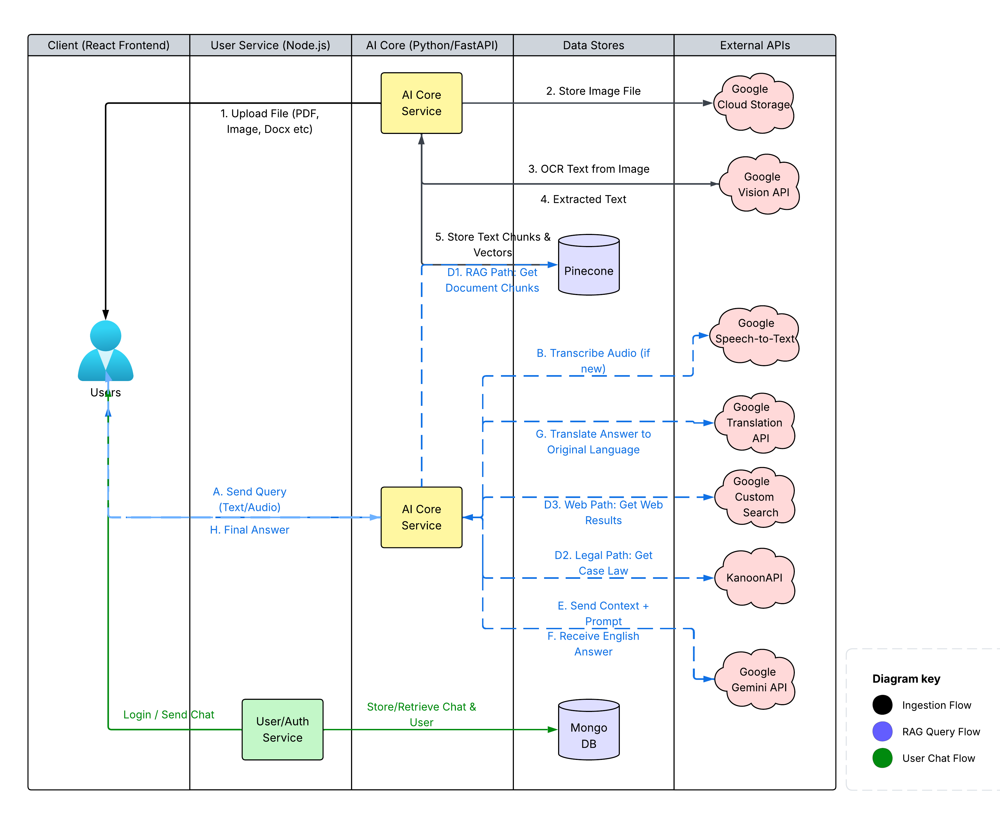

# Legal SahAI — AI-Powered Legal Intelligence Platform  
**Team: Crewmate** | [ Live Demo](https://legalsahai.vercel.app/) | [ Demo Video](https://www.youtube.com/watch?v=O4bvUjWqkKI)

> _Built for the [Gen AI Exchange Hackathon](https://vision.hack2skill.com/event/genaiexchangehackathon)_

---

##  Problem Statement
**Generative AI for Demystifying Legal Documents**

Legal SahAI is an AI-powered platform designed to make **legal documents and workflows understandable, accessible, and efficient**.  
It bridges the gap between **citizens and legal professionals** using **Generative AI, RAG, and multimodal processing**.

---

##  Key Features

###  1. AI Legal Desk
Upload any legal document — PDF, DOCX, image, or handwritten note — and unlock instant insights:
- **Chat with PDF:** Conversationally query your document.
- **AI Summary:** Concise, plain-language summary of key points.
- **Timeline Extraction:** Automatically organizes key events and dates.
- **Suggested Questions:** Generates relevant legal queries.
- **Predictive Analysis:** Forecasts potential case outcomes.
- **Case Law Suggestions:** Retrieves supporting precedents via Kanoon API.

---

###  2. Lawyer–Client Connection
A secure bridge between **Help Seekers** and **Legal Professionals**:
- **For Clients:** Search, filter, and contact verified lawyers.
- **For Lawyers:** Manage client requests and chat securely in-platform.

---

###  3. AI-Powered Form Assistant
Guides users in filling **complex government or legal forms** with:
- Smart field-by-field hints and data suggestions.
- Automated recognition of form blanks and required fields.

---

###  4. General Legal Chat
Ask general law-related questions — get instant, multilingual, AI-powered legal guidance.

---

##  Our AI & System Architecture

Our platform is built on a robust, service-oriented architecture designed for scalability and advanced AI processing.

### Key Architectural Concepts
* **Conditional RAG (Retrieval-Augmented Generation):** Our system is more than a simple RAG. A **Router Agent** intelligently decides the best source for an answer:
    1.  **Pinecone (Vector DB):** For information inside the user's private documents.
    2.  **KanoonAPI (External API):** For historical legal precedents and case law.
    3.  **Google Custom Search:** For general web-based legal queries.
* **True Multimodality (Input & Ingestion):**
    * **Interaction:** Users can ask questions via **typed text** or **voice** (using Google Speech-to-Text).
    * **Ingestion:** The system can process **PDFs, DOCX, images, and handwritten notes** (using Google Cloud Vision).
* **"Translate -> Process -> Translate Back" Architecture:** We use Google Cloud Translation to translate all non-English queries into English for high-accuracy processing by Gemini, then translate the answer back, ensuring a seamless multilingual experience.

---

##  Tech Stack

| Layer | Technology | Purpose |
|:------|:------------|:--------|
| **Frontend** | `React.js`, `Tailwind CSS`, `Zustand` | Client-side UI, state management, and user experience. |
| **Backend (User Service)** | `Node.js`, `Express.js` | Manages user auth, profiles, and lawyer-client chat. |
| **AI Core** | `Python`, `FastAPI` | Handles all AI processing, RAG, and document ingestion. |
| **Databases** | `MongoDB`, `Pinecone` | `MongoDB` for user data/chats. `Pinecone` for vector storage. |
| **Cloud & AI Services** | Google Cloud (`Gemini`, `Vision`, `Translate`, `Speech-to-Text`, `Search`, `Storage`) | Multimodal and multilingual AI backbone |

## Architecture Diagram

##  Acknowledgments

Built using open APIs and tools from:
- `Google Cloud` (Gemini, Vision, Translate, STT, Search, Storage)
- `KanoonAPI` for legal case data
- `LangChain` for AI orchestration

> “Empowering citizens with AI-driven legal clarity.” 

